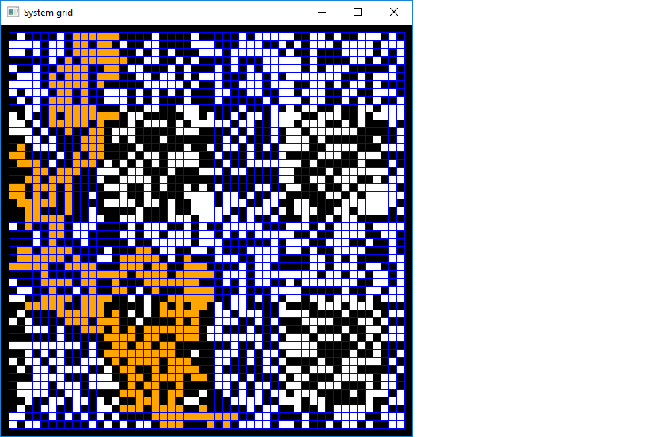
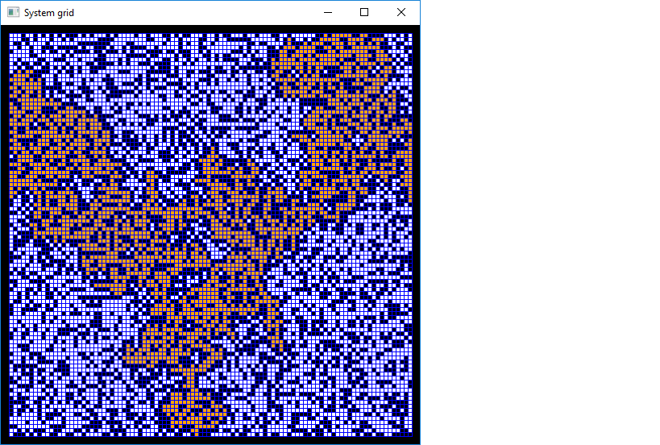
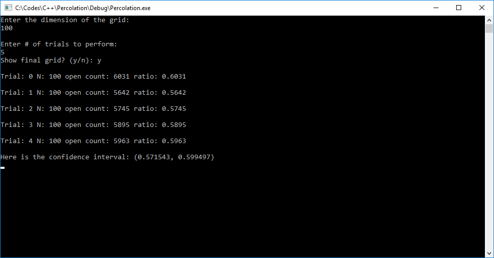
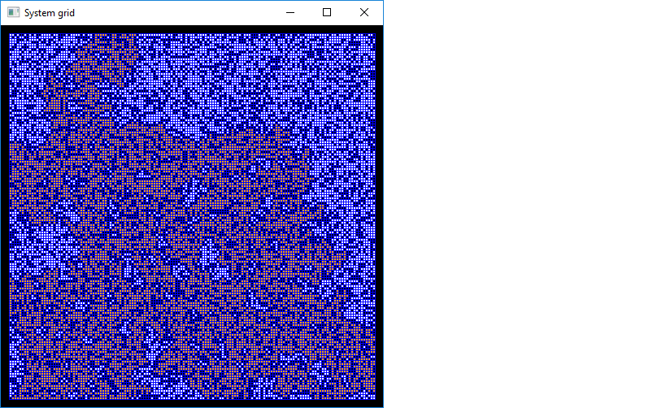
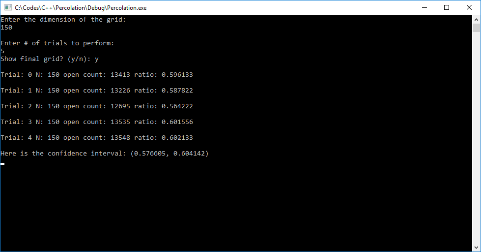

# Percolation (C++)

Percolation is the process of a liquid slowly passing through a filter. This program visualizes a system where given a grid, it opens individual cells one by one until there is a path from a bottom cell to a top cell(i.e if it percolates).
 
|size      	 |visualization					  |console								   | 
|------------|--------------------------------|----------------------------------------|
|50X50 grid	 |||
|100X100 grid|||
|150X150 grid|||

